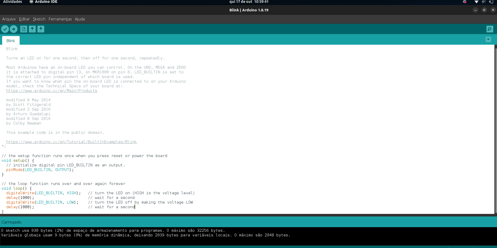
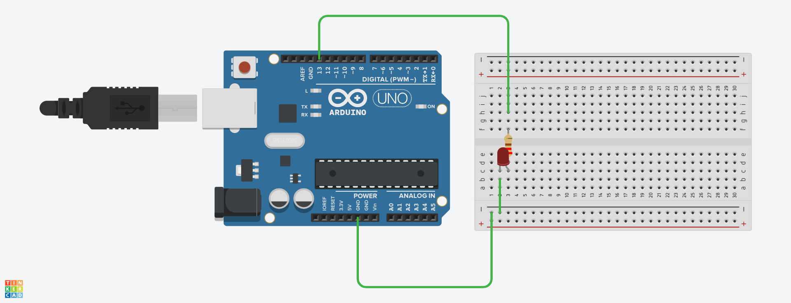
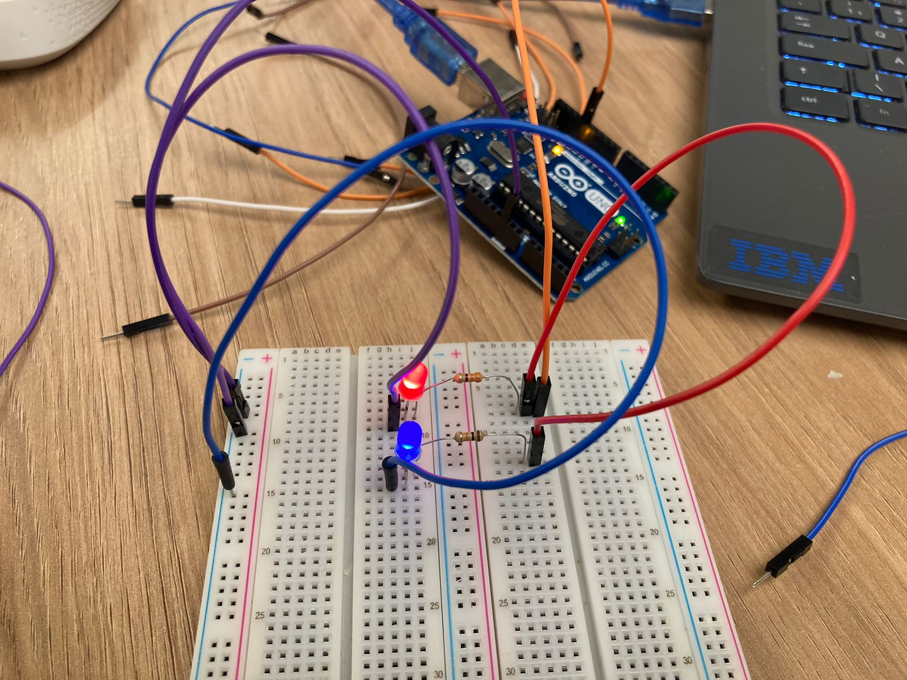

# Ponderada de Programação - Semana 1

## Descrição

O projeto tem como objetivo demonstrar o uso de LEDs interno e externo no Arduino, criando um efeito de pisca-pisca que simula um giroflex policial. A seguir, estão as instruções e as imagens que ilustram o funcionamento do projeto.

### Parte 1: Pisca-Pisca com LED Interno
Nesta primeira parte, o código faz o LED interno do Arduino (embutido na placa) piscar.



### Parte 2: Pisca-Pisca com LED Externo
Na segunda parte, o LED externo é conectado através de um circuito com jumpers e resistores de 330 Ohms. O LED pisca de acordo com o código implementado, simulando um giroflex.



### Extra: Sistema Físico - Giroflex Simulado
Além do projeto no Tinkercad, foi construído um sistema físico com dois LEDs piscando de forma alternada para simular o efeito de um giroflex policial.



Construi o sistema físico no protoboard como dois leds piscando de forma sequencial de maneira que simule um giroflex policial. 
## Funcionamento do Projeto

1. **Código LED Interno**: Faz o LED embutido no Arduino piscar.
2. **Circuito Externo**: Implementa um LED externo piscando com resistores e jumpers.
3. **Expansão**: O sistema físico foi construído para criar um efeito de dois LEDs piscando sequencialmente, simulando um giroflex.

---

### Clonagem do Projeto

Você pode clonar este repositório usando o comando:

```bash
git clone https://github.com/Bernardomeirelles/arduino.git
